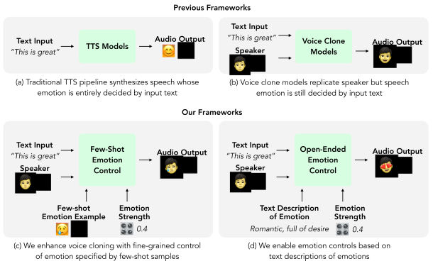

# `🎛️ EmoKnob`: EmoKnob: Enhance Voice Cloning with Fine-Grained Emotion Control

This repository contains the code and data for the paper [`EmoKnob`: Enhance Voice Cloning with Fine-Grained Emotion Control](https://arxiv.org/abs/2410.00316) by [Haozhe Chen](https://tonychen.xyz/), [Run Chen](https://www.cs.columbia.edu/speech/people.cgi?p=run), and [Julia Hirschberg](https://www.cs.columbia.edu/~julia/).

Check out our [project page](https://emoknob.cs.columbia.edu/) with audio samples and interactive [huggingface demo](https://huggingface.co/spaces/tonychenxyz/emo-knob)!




## Abstract

While recent advances in Text-to-Speech (TTS) technology produce natural and expressive speech, they lack the option for users to select emotion and control intensity. We propose EmoKnob, a framework that allows fine-grained emotion control in speech synthesis with few-shot demonstrative samples of arbitrary emotion. Our framework leverages the expressive speaker representation space made possible by recent advances in foundation voice cloning models. Based on the few-shot capability of our emotion control framework, we propose two methods to apply emotion control on emotions described by open-ended text, enabling an intuitive interface for controlling a diverse array of nuanced emotions. To facilitate a more systematic emotional speech synthesis field, we introduce a set of evaluation metrics designed to rigorously assess the faithfulness and recognizability of emotion control frameworks. Through objective and subjective evaluations, we show that our emotion control framework effectively embeds emotions into speech and surpasses emotion expressiveness of commercial TTS services.

## Getting Started

- Install dependencies
```
pip install -r requirements.txt
```

- View how to use EmoKnob in the [demo notebook](./demo.ipynb).

## Acknowledgement

`EmoKnob` is based on voice cloning backbone of [MetaVoice](https://github.com/metavoiceio/metavoice-src).

## Citation
If you find this repository helpful, please consider citing our paper:

```
@misc{chen2024emoknobenhancevoicecloning,
      title={EmoKnob: Enhance Voice Cloning with Fine-Grained Emotion Control}, 
      author={Haozhe Chen and Run Chen and Julia Hirschberg},
      year={2024},
      eprint={2410.00316},
      archivePrefix={arXiv},
      primaryClass={cs.CL},
      url={https://arxiv.org/abs/2410.00316}, 
}
```